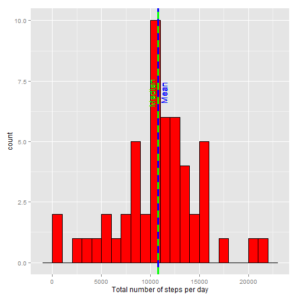
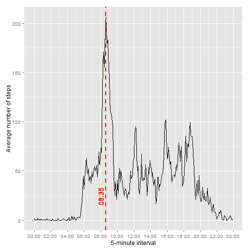
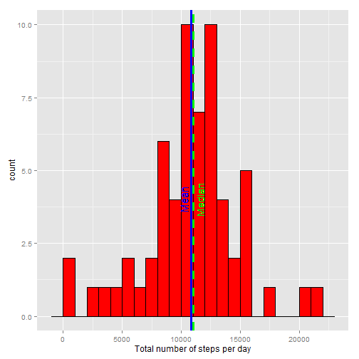
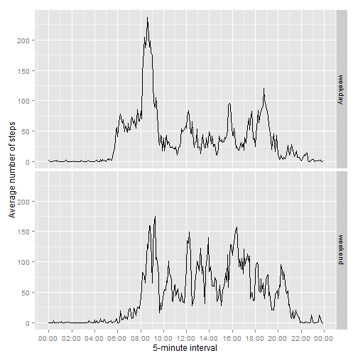

## Loading and preprocessing the data

I unzip and load the data.


```r
unzip("activity.zip")
df <- read.csv("activity.csv")
summary(df)
```

```
##      steps                date          interval     
##  Min.   :  0.00   2012-10-01:  288   Min.   :   0.0  
##  1st Qu.:  0.00   2012-10-02:  288   1st Qu.: 588.8  
##  Median :  0.00   2012-10-03:  288   Median :1177.5  
##  Mean   : 37.38   2012-10-04:  288   Mean   :1177.5  
##  3rd Qu.: 12.00   2012-10-05:  288   3rd Qu.:1766.2  
##  Max.   :806.00   2012-10-06:  288   Max.   :2355.0  
##  NA's   :2304     (Other)   :15840
```

The interval has a time format:


```r
unique(df$interval)
```

```
##   [1]    0    5   10   15   20   25   30   35   40   45   50   55  100  105
##  [15]  110  115  120  125  130  135  140  145  150  155  200  205  210  215
##  [29]  220  225  230  235  240  245  250  255  300  305  310  315  320  325
##  [43]  330  335  340  345  350  355  400  405  410  415  420  425  430  435
##  [57]  440  445  450  455  500  505  510  515  520  525  530  535  540  545
##  [71]  550  555  600  605  610  615  620  625  630  635  640  645  650  655
##  [85]  700  705  710  715  720  725  730  735  740  745  750  755  800  805
##  [99]  810  815  820  825  830  835  840  845  850  855  900  905  910  915
## [113]  920  925  930  935  940  945  950  955 1000 1005 1010 1015 1020 1025
## [127] 1030 1035 1040 1045 1050 1055 1100 1105 1110 1115 1120 1125 1130 1135
## [141] 1140 1145 1150 1155 1200 1205 1210 1215 1220 1225 1230 1235 1240 1245
## [155] 1250 1255 1300 1305 1310 1315 1320 1325 1330 1335 1340 1345 1350 1355
## [169] 1400 1405 1410 1415 1420 1425 1430 1435 1440 1445 1450 1455 1500 1505
## [183] 1510 1515 1520 1525 1530 1535 1540 1545 1550 1555 1600 1605 1610 1615
## [197] 1620 1625 1630 1635 1640 1645 1650 1655 1700 1705 1710 1715 1720 1725
## [211] 1730 1735 1740 1745 1750 1755 1800 1805 1810 1815 1820 1825 1830 1835
## [225] 1840 1845 1850 1855 1900 1905 1910 1915 1920 1925 1930 1935 1940 1945
## [239] 1950 1955 2000 2005 2010 2015 2020 2025 2030 2035 2040 2045 2050 2055
## [253] 2100 2105 2110 2115 2120 2125 2130 2135 2140 2145 2150 2155 2200 2205
## [267] 2210 2215 2220 2225 2230 2235 2240 2245 2250 2255 2300 2305 2310 2315
## [281] 2320 2325 2330 2335 2340 2345 2350 2355
```

I combine the date and the interval into a datetime.


```r
df$datetime <- as.POSIXct(paste(df$date, sprintf("%.4d", df$interval)), format="%Y-%m-%d %H%M")
head(df$datetime)
```

```
## [1] "2012-10-01 00:00:00 BST" "2012-10-01 00:05:00 BST"
## [3] "2012-10-01 00:10:00 BST" "2012-10-01 00:15:00 BST"
## [5] "2012-10-01 00:20:00 BST" "2012-10-01 00:25:00 BST"
```

I parse the date string into a date value. 


```r
df$date <- as.Date(df$date, format="%Y-%m-%d")
head(df$date)
```

```
## [1] "2012-10-01" "2012-10-01" "2012-10-01" "2012-10-01" "2012-10-01"
## [6] "2012-10-01"
```

I parse the interval into a datetime where I will only use the time. (Note that todays date is going to be used, but we will ignore this part)


```r
df$time <- as.POSIXct(sprintf("%.4d", df$interval), format="%H%M")
head(df$time)
```

```
## [1] "2015-03-10 00:00:00 GMT" "2015-03-10 00:05:00 GMT"
## [3] "2015-03-10 00:10:00 GMT" "2015-03-10 00:15:00 GMT"
## [5] "2015-03-10 00:20:00 GMT" "2015-03-10 00:25:00 GMT"
```


## What is mean total number of steps taken per day?

I keep the part of the data where the steps are not missing.


```r
df.not.na <- df[!is.na(df$steps),]
day.total <- aggregate(df.not.na$steps, list(df.not.na$date), sum)
names(day.total) <- c("date", "steps")

meanTotalSteps <- mean(day.total$steps)
medianTotalSteps <- median(day.total$steps)
```

The total number of steps per day has

- mean equal to **10766.2**, and
- median equal to **10765**.

I make a histogram of the total number of steps pre day, and draw the mean and the median.


```r
library(ggplot2)
h <- ggplot(day.total, aes(x=steps)) + 
     geom_histogram(binwidth=1000, colour="black", fill="red") + 
     xlab("Total number of steps per day") +
     geom_vline(xintercept=meanTotalSteps, color="blue", size=1.2) +
     geom_vline(xintercept=medianTotalSteps, color="green", linetype="dashed", size=1.2) + 
     geom_text(aes(x=meanTotalSteps, label="\nMean", y=7), 
               colour="blue", angle=90, text=element_text(size=10)) +
     geom_text(aes(x=medianTotalSteps, label="Median\n", y=7), 
               colour="green", angle=90, text=element_text(size=10))
h
```

 


## What is the average daily activity pattern?

I average the number of steps for each 5-minute interval accross all days.


```r
interval.average <- aggregate(df.not.na$steps, list(df.not.na$time), mean)
names(interval.average) <- c("time", "steps")
```

I find the time of the interval with the maximum number of steps.


```r
maxStepInterval <- interval.average[which.max(interval.average$steps),]$time
maxStepTime <- strftime(maxStepInterval, format="%H:%M")
```

On average across all the days in the dataset, the maximum number of steps are in the 5-minute interval at **08:35**.

I make a time series plot of the average number of steps for each 5-minute interval of the day.


```r
library(scales)

p <- ggplot(interval.average, aes(x=time, y=steps)) + geom_line() +
     xlab("5-minute interval") +
     ylab("Average number of steps") +
     scale_x_datetime(breaks=("2 hour"), 
                      labels=date_format("%H:%M")) +
     geom_vline(xintercept=as.numeric(maxStepInterval), color="red", linetype="dashed", size=0.75) +
     geom_text(aes(x=maxStepInterval, label=paste(maxStepTime, "\n"), y=25), 
               colour="red", angle=90, text=element_text(size=12))
     
p
```

 

## Imputing missing values

The number of missing values for each column is:


```r
sapply(names(df), function(c) sum(is.na(df[,c])))
```

```
##    steps     date interval datetime     time 
##     2304        0        0        0        0
```

I add the day of the week to the data frame.


```r
df$day <- weekdays(as.Date(df$date))
head(df$day)
```

```
## [1] "Monday" "Monday" "Monday" "Monday" "Monday" "Monday"
```

I add a column that contains the date of the week and the 5-minute interval combined into one field.


```r
df$day.interval <- as.factor(paste(df$day, sprintf("%.4d", df$interval)))
head(df$day.interval)
```

```
## [1] Monday 0000 Monday 0005 Monday 0010 Monday 0015 Monday 0020 Monday 0025
## 2016 Levels: Friday 0000 Friday 0005 Friday 0010 Friday 0015 ... Wednesday 2355
```

I calculate the average number of steps for a specific interval in a specific day of the week.


```r
day.interval.average <- aggregate(df$steps, list(df$day.interval), mean, na.rm=TRUE)
names(day.interval.average) <- c("day.interval","steps")
head(day.interval.average)
```

```
##   day.interval steps
## 1  Friday 0000     0
## 2  Friday 0005     0
## 3  Friday 0010     0
## 4  Friday 0015     0
## 5  Friday 0020     0
## 6  Friday 0025     0
```

I create a new data frame and fill in the missing steps with the average steps accross all weeks, for the same interval and day of the week.


```r
average.for.day.interval <- function(day.interv) {
    day.interval.average[day.interval.average$day.interval == day.interv,"steps"]
}
df.imputed <- transform(df, steps = ifelse(is.na(steps), 
                                           sapply(df$day.interval, average.for.day.interval), 
                                           steps))
```

I double check that there are no missing values in the imputed data frame.


```r
sapply(names(df.imputed), function(c) sum(is.na(df.imputed[,c])))
```

```
##        steps         date     interval     datetime         time 
##            0            0            0            0            0 
##          day day.interval 
##            0            0
```


```r
day.total2 <- aggregate(df.imputed$steps, list(df.imputed$date), sum)
names(day.total2) <- c("date", "steps")
meanTotalSteps2 <- mean(day.total2$steps)
medianTotalSteps2 <- median(day.total2$steps)
```

The total number of steps per day in the imputed data has

- mean equal to **10821.2**, and
- median equal to **11015.0**.

The change in these values compared to the data with missing values is

- mean change: **55.0**, and
- median change: **250.0**.

Both the mean and median have increased. The median has increased 
**4.5**
times more compared to the increase of the mean.

I make a histogram of the total number of steps per day, and draw the mean and the median, this time for the imputed data.


```r
h2 <- ggplot(day.total2, aes(x=steps)) + 
      geom_histogram(binwidth=1000, colour="black", fill="red") + 
      xlab("Total number of steps per day") +
      geom_vline(xintercept=meanTotalSteps2, color="blue", size=1.2) +
      geom_vline(xintercept=medianTotalSteps2, color="green", linetype="dashed", size=1.2) + 
      geom_text(aes(x=meanTotalSteps2, label="Mean\n", y=4), 
                colour="blue", angle=90, text=element_text(size=10)) +
      geom_text(aes(x=medianTotalSteps2, label="\nMedian", y=4), 
                colour="green", angle=90, text=element_text(size=10))
h2
```

 

## Are there differences in activity patterns between weekdays and weekends?

I create a factor variable that tells whether the sample is during the weekend or a weekday.

```r
df.imputed$weekday = as.factor(ifelse(df.imputed$day == "Saturday" | df.imputed$day == "Sunday", 
                                      "weekend", "weekday"))
```

I take the the mean number of steps for each interval during the week and during the weekend separately.


```r
weekday.interval.average <- aggregate(steps ~ time + weekday, data=df.imputed, mean)
```

I plot the average steps during the week and during the weekend.


```r
p2 <- ggplot(weekday.interval.average, aes(x=time,y=steps)) + 
      geom_line() +
      xlab("5-minute interval") +
      ylab("Average number of steps") +
      facet_grid(weekday ~ .) +
      scale_x_datetime(breaks=("2 hour"), 
                       labels=date_format("%H:%M"))
p2
```

 


